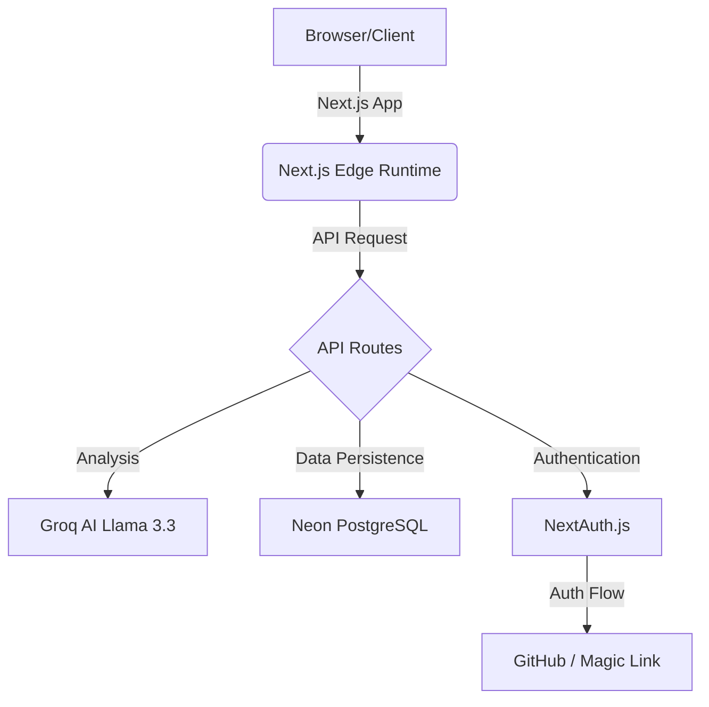

# ResumeAI — Case Study

## Project Overview
- **Live URL:** [https://resume-ai-ten-gamma.vercel.app](https://resume-ai-ten-gamma.vercel.app)
- **GitHub:** [https://github.com/sifat5398/resume-ai](https://github.com/sifat5398/resume-ai)
- **Type:** AI SaaS Web Application (Portfolio Project)
- **Role:** Full-Stack Developer (Solo)
- **Stack:** Next.js 14, TypeScript, Groq AI (Llama 3.3 70B), PostgreSQL, Vercel

---

## The Problem

Job seekers spend hours perfecting resumes without knowing if they'll pass ATS (Applicant Tracking System) filters. Studies show that roughly 75% of resumes are rejected by ATS before a human recruiter ever sees them. This "black hole" of job applications leaves qualified candidates frustrated and stuck in the initial screening phase.

Existing resume review tools are often locked behind expensive paywalls. Platforms like Resumeworded ($19/month) or Jobscan ($49/month) offer powerful analysis but are inaccessible to many entry-level or unemployed job seekers. Furthermore, many tools provide generic feedback that lacks the actionable specifics needed to make meaningful improvements.

There was a clear gap in the market for a tool that combines high-fidelity ATS scoring, detailed section-by-section AI feedback, and instant keyword suggestions in one accessible place. ResumeAI was built to bridge this gap, providing elite-level career coaching for free.

---

## The Solution

ResumeAI provides:
- ⚡ **Instant AI review** in under 30 seconds
- 📊 **Overall ATS score** (0-100)
- 🔍 **Section-by-section feedback**: Detailed breakdown for Summary, Experience, Skills, and Education
- 🔑 **8 ATS keyword suggestions** per review to close keyword gaps
- ✅ **Top 3 strengths** identified to reinforce what's working
- ⚠️ **Top 3 improvements** with specific, actionable steps
- 🔒 **Secure** — resume text is used for analysis and stored for history, but not sold or used for training

---

## What Makes ResumeAI Unique

### vs. The Competition

| Feature | ResumeAI | Resumeworded | Jobscan | Resume.io |
|---------|----------|--------------|---------|-----------|
| Free tier | ✅ Yes | ❌ $19/mo | ❌ $49/mo | ❌ $6/mo |
| ATS Score | ✅ Yes | ✅ Yes | ✅ Yes | ❌ No |
| Section Feedback | ✅ Yes | ✅ Yes | ❌ No | ✅ Yes |
| Speed | ✅ < 30s | ❌ 2-3 min | ❌ 2-3 min | ❌ Manual |
| No signup needed | ✅ Yes | ❌ Required | ❌ Required | ❌ Required |
| AI Model | ✅ LLaMA 3.3 70B | GPT-based | Rules-based | Templates |
| Open Source | ✅ Yes | ❌ No | ❌ No | ❌ No |

### Key Differentiators
1. **SPEED** — Analysis is completed in under 30s vs the industry average of 2-3 minutes.
2. **FREE** — No credit card required and no paywall for core audit features.
3. **STRUCTURED** — Provides per-section scores, allowing users to target specific weak points.
4. **ATS-FIRST** — Built specifically around keyword gap analysis and formatting for scanners.
5. **TRANSPARENT** — The project is open source, allowing users to see exactly how their data is handled.

---

## Technical Architecture

### Stack Decisions & Why

- **Next.js 14 App Router** — Chosen for its powerful Server Components, built-in API routes, and optimized deployment flow on Vercel.
- **Groq + LLaMA 3.3 70B** — Chosen over OpenAI or Anthropic for its incredible 10x faster inference speed and generous free tier for developers.
- **Neon PostgreSQL** — A serverless PostgreSQL solution that scales to zero, making it cost-effective for a portfolio project while providing production-grade performance.
- **NextAuth.js** — Handles both GitHub OAuth and Email Magic Links with a unified Prisma adapter, ensuring a seamless login experience.
- **pdf-parse (server-side)** — Handles resume text extraction securely on the server, keeping heavy processing off the client's device.

### Architecture Diagram

---

## Key Technical Challenges

### 1. Structured JSON from LLM
**Challenge**: Large Language Models often return conversational filler or markdown code fences (like \`\`\`json) which break `JSON.parse()`.
**Solution**: Implemented a strict system prompt combined with a custom cleaning utility that uses RegEx to strip markdown markers and conversational padding, followed by a descriptive error fallback system.

### 2. PDF Parsing on Serverless
**Challenge**: `pdf-parse` relies on Node.js-specific Buffers and file system utilities, which aren't available in the Edge runtime or on the client-side.
**Solution**: Created a dedicated server-side API route (`/api/extract-pdf`) that specifically uses the standard Node.js runtime, allowing it to process base64-encoded PDF data and return clean text to the client.

### 3. Rate Limiting Without Redis
**Challenge**: Most production rate-limiting solutions require Redis (like Upstash), which adds complexity and cost.
**Solution**: Developed a lightweight database-driven rate limiter. The system queries the `Review` table for the specific `userId` within the last hour. If the count exceeds 5, the request is rejected with a 429 status.

### 4. Auth Session with Multiple Providers
**Challenge**: Ensuring that users logging in via GitHub and those using Magic Links are recognized as the same user if they use the same email.
**Solution**: Configured the NextAuth PrismaAdapter with a unified `User` model. This allows automatic account linking where the email serves as the primary identifier across providers.

### 5. Prisma on Vercel (Version Conflict)
**Challenge**: A mismatch between local and Vercel environments caused Prisma v7 to be installed in production, which deprecated the `url` property used in our v5-based schema.
**Solution**: Pinned the exact version `5.22.0` for both `prisma` and `@prisma/client` in `package.json` to ensure consistency across all environments.

---

## Results

- ✅ **Built and deployed in under 3 days** as a solo developer.
- ✅ **Zero downtime** — Integrated Vercel CI/CD for automatic deployment on every push.
- ✅ **Full-stack TypeScript** — Achieved a codebase with 0 type errors.
- ✅ **Serverless architecture** — Scales automatically with traffic without manual intervention.
- ✅ **Live at**: [https://resume-ai-ten-gamma.vercel.app](https://resume-ai-ten-gamma.vercel.app)

---

## What I Learned

1. **Serverless Constraints**: Navigating the differences between Edge and Node.js runtimes for libraries like `pdf-parse`.
2. **LLM Prompt Engineering**: Designing prompts that force LLMs to adhere strictly to JSON schemas for downstream consumption.
3. **NextAuth Adapter Pattern**: Understanding how adapters manage user identities across disparate OAuth and magic link providers.
4. **Vercel Deployment Lifecycle**: Mastering build commands and environment variable management for production-ready apps.
5. **Dependency Management**: The critical importance of pinning dependency versions (like Prisma) to prevent breaking changes in production.

---

## Future Roadmap

- [ ] **Job Description Matching** — Paste a JD and get a specific match score and gap analysis.
- [ ] **LinkedIn Import** — Import profile data directly via LinkedIn URL.
- [ ] **Cover Letter Generator** — AI-generated cover letters based on the resume and a specific JD.
- [ ] **Resume Templates** — Export optimized resumes directly to PDF.
- [ ] **Recruiter Dashboard** — A "Bulk Mode" for recruiters to review dozens of resumes at once.

---

## Links
- 🌐 **Live**: [https://resume-ai-ten-gamma.vercel.app](https://resume-ai-ten-gamma.vercel.app)
- 💻 **GitHub**: [https://github.com/sifat5398/resume-ai](https://github.com/sifat5398/resume-ai)
- 👤 **Built by**: Sifat Rahman
